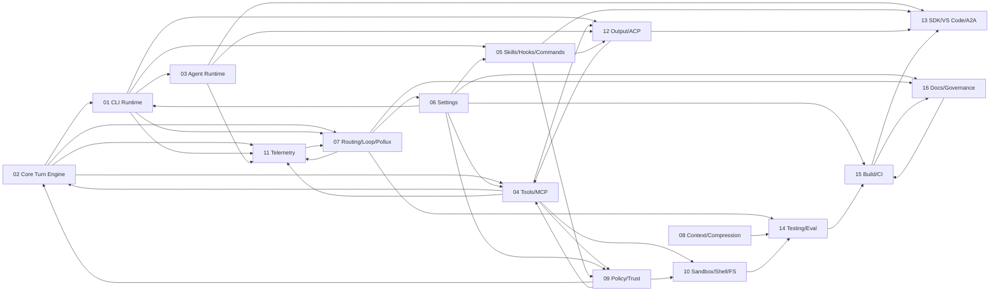

# Cross-Compartment Synthesis — Pollux Integration Readiness

Capstone synthesis of the 16 compartment reports. Composes their claims,
surfaces systemic signals, and produces the Pollux go/no-go readiness table.
Does not re-verify individual compartment claims; citations are to compartment
reports (and their sidecars), never back to source.

- **Compartments covered**: 16 of 16 (100%). See `../INDEX.md` for status.
- **Inputs**: every `reports/NN-<slug>/report.json` + `report.md`,
  `reports/TIER1_SUMMARY.md`, `INDEX.md`, `POLLUX_PRIORITY.md`.
- **Commit spread across reports**: `b43e7661` (01, 02, 04, 06, 07) and
  `c8127045` (03, 05, 08–16). Compartment 02 used `58c7bff` and reconfirmed
  cross-cutting claims at `b43e7661`. No contradiction between commits surfaced.
- **Author**: composer-agent, 2026-04-16.

---

## 1. Executive summary

The Pollux scaffold (`packages/core/src/pollux/index.ts`, 171 bytes,
`export {};` only) has **zero runtime integration**. Every compartment
independently reconfirmed this (02, 06, 07 primary; 01, 04, 05, 11, 12, 14
negative searches). The remaining 15 compartments describe a mature Gemini CLI
fork whose architecture does not match four of the ten spec assumptions in
`POLLUX_SPEC.md`. These misalignments — not missing code — are the primary
blockers for implementation.

Concretely:

1. **Five turn drivers, not one.** A Pollux interceptor placed only between
   `GeminiClient` and `Turn` reaches 2 of 5 drivers (interactive-legacy +
   non-interactive-legacy). Both agent-session drivers (via
   `LegacyAgentSession`), the ACP driver (`GeminiAgent.prompt` calling
   `GeminiChat.sendMessageStream` directly), and A2A's `CoderAgentExecutor`
   bypass the proposed seam. See `01-cli-runtime-surface/report.md` §2,
   `03-agent-runtime-and-modes/report.md` §3,
   `12-output-protocol-and-acp-adapters/report.md` §3,
   `13-integration-products-sdk-vscode-a2a-devtools/report.md` §3.
2. **Token logging already exists end-to-end.** `LoggingContentGenerator` +
   `ChatRecordingService.recordMessageTokens` capture every LLM call tagged by
   `LlmRole` (11 values including 9 `UTILITY_*`). A parallel `pollux/logger.ts`
   would duplicate or diverge. See `02-core-turn-engine/report.md` §4 (T6, T9),
   `11-telemetry-observability-and-billing-signals/report.md` §4.
3. **"Single-model baseline" is false.** Router emits up to one `UTILITY_ROUTER`
   LLM call per prompt; loop detector fires 0–2 `UTILITY_LOOP_DETECTOR` calls
   starting at turn 30 (Flash + optional `gemini-3-pro-preview` double-check).
   No harness in the repo suppresses either. Condition A/E benchmark numbers are
   invalid without explicit pins. See
   `07-routing-availability-loop-and-pollux/report.md` §4 (T3, T7, T8),
   `14-testing-and-evaluation-architecture/report.md` §3 (C-14.1).
4. **Synthetic tool is not free.** The policy engine default-denies in
   non-interactive mode unless an explicit ALLOW rule ships; ACP uses
   `connection.requestPermission` (not the policy engine) and would also prompt.
   See `09-policy-trust-and-safety-engine/report.md` §3 (R-09.1),
   `12-output-protocol-and-acp-adapters/report.md` §3 (R-12.2),
   `04-tools-and-mcp-platform/report.md` §3 (C-04.2).
5. **`/pollux` surface fragmentation.** Three/four independent command
   registries exist: interactive `CommandService` (Builtin + Skill + McpPrompt
   - File); non-interactive (Builtin + McpPrompt + File — **Skill dropped**);
     ACP's bespoke `commandRegistry`; A2A's disjoint `command-registry`.
     Shipping `/pollux` once does not make it reachable everywhere. See
     `01-cli-runtime-surface/report.md` §2 (VT-6, VT-7),
     `05-extensibility-skills-hooks-commands/report.md` §4, `12-.../report.md`
     §3 (C-12.2), `13-.../report.md` §3.
6. **Settings block not present; ConfigParameters silent drift is possible.**
   CLI owns schema; core consumes `ConfigParameters`. Adding a `pollux` field in
   core without wiring in `loadCliConfig` typechecks but defaults to `undefined`
   at runtime. See `06-settings-schema-and-config-plumbing/report.md` §4 (R-06
   high), §6 Appendix B.

Recommended go/no-go: **not ready.** Unblocking requires (a) deciding the
interceptor seam per driver (SR-1), (b) extending the existing token sink
instead of a new logger (SR-2), (c) building a benchmark harness with
router/loop pins (SR-3), (d) shipping a packaged policy allow-rule for the
advisor synthetic tool (SR-5), and (e) choosing one of two documented settings
paths (experimental → top-level) from 06 §B.

---

## 2. Integration map

### 2.1 Edges declared in sidecars

Edges are read from each sidecar's `handoffs.dependsOn` and `handoffs.affects`.



### 2.2 Integration ambiguities (asymmetric edges)

These are edges asserted in one sidecar but **not** mirrored in the counterpart.
They are integration ambiguities surfaced for compartment owners to reconcile;
the synthesis does not silently rewrite them.

| From | To             | Direction declared                     | Counterpart says                                                                                                                   |
| ---- | -------------- | -------------------------------------- | ---------------------------------------------------------------------------------------------------------------------------------- |
| 01   | 05, 07, 11     | `affects`                              | 05/07/11 do not list 01 in `dependsOn`                                                                                             |
| 03   | 02, 11         | `dependsOn` (03→02), `affects` (03→11) | 02 does not list 03 in `affects`; 11 does not list 03 in `dependsOn`                                                               |
| 04   | 5              | `dependsOn`                            | 05 does not list 04 in `affects`                                                                                                   |
| 04   | 11, 12         | `affects`                              | 11 lists only 02; 12 lists 01+02                                                                                                   |
| 05   | 4              | `dependsOn`                            | 04 does not list 05 in `affects`                                                                                                   |
| 07   | 16             | `affects`                              | 16 lists 07 in `dependsOn` ✓ (no ambiguity); but 07 does not list 11 in `affects` while 11 `affects` 07 — direction flipped        |
| 09   | 04             | `dependsOn` & `affects` (mutual)       | 04 `dependsOn` 09 + `affects` 09 — mutually cyclic (genuine bidirectional coupling, see SR-5)                                      |
| 14   | 03, 05, 08, 10 | `dependsOn`                            | 03, 05, 08, 10 do not list 14 in `affects` — consistent with 14 being downstream consumer, but reverse edges missing from all four |

**Interpretation.** The ambiguities cluster around three patterns:

1. **Telemetry as passive sink** (11 has only `dependsOn: [2]`, `affects: [7]`).
   Most compartments naturally "affect" telemetry but 11 does not model the
   reverse. This is a sidecar-schema artefact, not a real integration bug.
2. **14 downstream of everybody.** Testing depends on nearly every compartment
   but no producer declares 14 as affected. Also schema-artefact-level.
3. **09 ↔ 04 cycle is real.** Policy engine and tools genuinely co-own
   invocation gating; SR-5 depends on resolving this cycle when the
   `advisor_consultation` synthetic tool lands.

No ambiguity contradicts a verified truth in any report. No edge was silently
rewritten.

### 2.3 Critical path narrative (where Pollux attaches)

From the above graph, the **shortest Pollux-relevant path** from a user prompt
to billable model output is:

```
01 CLI dispatcher
  → 02 Core turn engine (GeminiClient.sendMessageStream → processTurn → Turn.run)
     → 07 Routing + loop detection (inside processTurn)
     → 04 Tools + MCP (ToolCallRequest → Scheduler → ToolExecutor)
     → 11 Telemetry (LoggingContentGenerator + ChatRecordingService)
```

The spec's "one interceptor between GeminiClient and Turn" reaches this spine
for the legacy drivers only. The agent-session + ACP + A2A drivers each have
their own spine that forks upstream of `GeminiClient.sendMessageStream`. See
SR-1.

---

## 3. Cross-compartment contradictions

### 3.1 Resolved by synthesis

| #   | Compartment  | Description                                                                                                                                                           | Resolution                                                                                                          |
| --- | ------------ | --------------------------------------------------------------------------------------------------------------------------------------------------------------------- | ------------------------------------------------------------------------------------------------------------------- |
| R-1 | 09.1         | Guideline cited `coreToolScheduler.ts` as policy consumer; actual consumer is `scheduler/scheduler.ts`.                                                               | Already marked `resolved` in 09's sidecar. No further action.                                                       |
| R-2 | 09.2         | `FolderTrustDiscoveryService` listed as policy-engine dependency; actually consumed by UI/extension flows.                                                            | `resolved` in 09's sidecar.                                                                                         |
| R-3 | 10.1         | Guideline lists `bundle/sandbox-*.sb` as primary; generated at bundle time, not tracked.                                                                              | `resolved` in 10's sidecar (evidence from `scripts/build_binary.js:281-288`).                                       |
| R-4 | 10.2         | Windows has `sandbox/windows/commandSafety.ts` separate from `sandbox/utils/commandSafety.ts`.                                                                        | `resolved` in 10's sidecar; sandboxManager imports both under aliases.                                              |
| R-5 | 13.1         | Guideline lists `packages/devtools/client/src`; devtools ships pre-rendered.                                                                                          | `resolved` in 13's sidecar.                                                                                         |
| R-6 | 01.5 vs 03.4 | Conditional `useAgentStream`/`useGeminiStream` hook in `AppContainer.tsx:1186-1216` behind `rules-of-hooks` bypass. 01 flagged as C-01.5; 03 flagged again as R-03.4. | **Resolved by synthesis as single risk SR-8** (see §4). The flag is effectively mount-time-only; treat as contract. |

### 3.2 Unresolved / deferred

Grouped by theme. Every entry lists the originating sidecar and the
compartment(s) the resolution now depends on. These feed §9 "Recommended next
actions."

#### 3.2.1 Interceptor seam (multi-driver)

- **02 C-02.8** — "wire interceptor into client.ts at processTurn()" is
  underspecified (per-event vs per-turn). `→ owners: 02, 07`.
- **02 C-02.1** — stream pause/resume is not a turn-level primitive.
  `→ owners: 02, 07`.
- **03 C-03.1** — agent-session drivers bypass GeminiClient. `→ owners: 02, 03`.
- **12 C-12.1** — two parallel non-interactive drivers translate distinct event
  unions to the same JSONL. `→ owners: 03, 12`.
- **13 R-13.2** — A2A's `CoderAgentExecutor` bypasses the seam entirely.
  `→ owners: 13, 02`.
- **01 C-01.1**, **01 C-01.2** — spec "CLI unchanged" contradicted by Phase 7.
  `→ owners: 01, 16`.

These compose into **SR-1** (§4).

#### 3.2.2 Token logger duplication

- **02 C-02.2** — Pollux logger duplicates `LoggingContentGenerator` +
  `chatRecordingService.recordMessageTokens`. `→ owners: 02, 11`.
- **11 C-11.1** — TurnLog duplicates per-chunk capture at
  `geminiChat.ts:915-921`. `→ owners: 11, 16`.
- **02 C-02.5** — spec advisor uses `generateContent` directly instead of
  `BaseLlmClient.generateJson`. `→ owners: 02, 07`.

Composes into **SR-2**.

#### 3.2.3 Baseline / benchmark fairness

- **02 C-02.3** — 9 UTILITY\_\* roles fire per turn; "single-model baseline" is
  false. `→ owners: 02, 07, 14`.
- **07 C-07.1** — router + loop-detection emit silent UTILITY LLM calls; spec
  conditions A/E unreproducible. `→ owners: 07, 14`.
- **14 C-14.1** — no benchmark harness suppresses either source. `→ owners: 14`.
- **07 C-07.5** — synthetic-tool advisor does not compose with pre-turn routing
  decision (router is per-prompt, not per-event). `→ owners: 04, 07`.

Composes into **SR-3**.

#### 3.2.4 Command / output fragmentation (/pollux surface)

- **01 C-01.3** — non-interactive `SkillCommandLoader` omitted.
  `→ owners: 01, 05`.
- **01 C-01.4** — ACP `handleCommand` ignores `parts: Part[]`.
  `→ owners: 01, 12`.
- **05 C-05.2** — spec §10 Phase 7 `/pollux` has no implementation.
  `→ owners: 05, 16`.
- **12 C-12.2** — ACP command surface vs non-interactive differs.
  `→ owners: 12, 13`.

Composes into **SR-4**.

#### 3.2.5 Policy / dual approval surfaces (synthetic tool)

- **04 C-04.2** — static `Set<string>` MCP allowlist parallels persistent
  policy. `→ owners: 04, 09`.
- **04 C-04.7** — dotted (`server.tool`) vs underscore (`mcp_server_tool`) key
  divergence. `→ owners: 04, 09`.
- **04 C-04.3** — `respectsAutoEdit=true` narrower than `ApprovalMode` docs
  imply. `→ owners: 04, 09`.
- **Implicit coupling (09 + 12)** — advisor_consultation default-denies in
  non-interactive (09 R-09.1); ACP prompts via `connection.requestPermission`
  not the policy engine (12 R-12.2). `→ owners: 09, 12`.

Composes into **SR-5**.

#### 3.2.6 Settings & ConfigParameters

- **06 C-06.1** — spec implies core (`config.ts`) is settings reader; CLI is
  canonical. `→ owners: 06, 16`.
- **06 C-06.3** — `BrowserAgentCustomConfig` drifts between core and CLI schema.
  `→ owners: 06`.
- **06 C-06.4** — `admin.*` in user/system files silently dropped.
  `→ owners: 06`.
- **06 C-06.2** — `settingPaths.ts` looks like a registry but holds one
  constant. `→ owners: 06`.

Composes into **SR-6**.

#### 3.2.7 Docs/spec desynchronization

- **07 C-07.3** — `docs/cli/model-routing.md` omits classifier, numerical,
  approval-mode strategies. `→ owners: 07, 16`.
- **16 C-16.1** — broken `docs/assets/gemini-screenshot.png` reference in
  README. `→ owners: 16`.
- **16 C-16.2** — spec/plan lack version header. `→ owners: 15, 16`.
- **16 C-16.3** — F-05 + F-06 absent from `POLLUX_PRIORITY.md` mapping.
  `→ owners: 16` (resolved by §8 below).
- **15 C-15.1** — `test-build-binary.yml` workflow_dispatch-only.
  `→ owners: 15`.

Composes into **SR-7**.

#### 3.2.8 MCP-specific

- **04 C-04.1** — two MCP discovery drivers with divergent lifecycles
  (`McpClient.discoverInto` + exported `connectAndDiscover`). `→ owners: 04`.
- **04 C-04.5** — `generateValidName` truncation can silently collide.
  `→ owners: 04`.
- **04 C-04.6** — `mcp-client.ts` 2151 lines over reading-budget.
  `→ owners: 04`.

These are not systemic but are tracked as tier-2 risks in §4.

#### 3.2.9 Routing internal

- **07 C-07.2** — router exception fallback bypasses availability; compensated
  only by `applyModelSelection`. `→ owners: 07`.
- **07 C-07.6** — ClassifierStrategy + NumericalClassifierStrategy coupled via
  inverse `getNumericalRoutingEnabled()` / `isGemini3Model()` checks.
  `→ owners: 07`.
- **07 C-07.7** — DefaultStrategy does not consult availability. `→ owners: 07`.

Tracked as compartment-local, not systemic.

---

## 4. Systemic risks (3+ compartment recurrence)

A systemic risk is one surfaced (by similar description) in ≥ 3 compartment
sidecars. Seven systemic risks meet that threshold.

### SR-1 — Multi-driver interceptor fragmentation

**Severity: high.** A Pollux interceptor placed only at the
`GeminiClient`/`Turn` seam reaches 2 of 5 execution drivers. The three bypassed
drivers (interactive agent-session, non-interactive agent-session, ACP) and
A2A's `CoderAgentExecutor` each have separate upstream entry points.

- Citations: `01-cli-runtime-surface/report.md` §2 + R-01.1;
  `02-core-turn-engine/report.md` §4 C-02.8;
  `03-agent-runtime-and-modes/report.md` §4 C-03.1;
  `12-output-protocol-and-acp-adapters/report.md` §3 C-12.1;
  `13-integration-products-sdk-vscode-a2a-devtools/report.md` §3 R-13.2.
- Affected compartments: **5** (01, 02, 03, 12, 13).
- Suggested mitigation: tag each turn with a driver identifier; require Pollux
  to emit one log per driver; explicit A2A-out-of-scope Phase 1 statement or
  A2A-specific interceptor.

### SR-2 — Parallel token sink duplicates existing capture

**Severity: medium.** `POLLUX_SPEC.md` §8 proposes a new `pollux/logger.ts`.
`LoggingContentGenerator` + `ChatRecordingService.recordMessageTokens` already
record every LLM call tagged by `LlmRole` (11 values, 9 UTILITY\_\*).
Duplicating the sink will drift from persisted conversation totals and
`gemini_cli.token.usage` metric.

- Citations: `02-core-turn-engine/report.md` §4 T6, T9 + C-02.2;
  `11-telemetry-observability-and-billing-signals/report.md` §4 C-11.1 + R-11.3;
  `07-routing-availability-loop-and-pollux/report.md` §4 T3 (router tokens flow
  through same sink).
- Affected compartments: **3** (02, 07, 11).
- Suggested mitigation: add one `LlmRole.UTILITY_ADVISOR` value and reuse
  existing telemetry. Do not author `pollux/logger.ts`. Assert conversation file
  totals match metric export in an integration test.

### SR-3 — Router + loop-detection break "zero-baseline" benchmark fairness

**Severity: high.** The spec's Condition A / E claim of "zero extra API calls /
zero latency" is false. Router fires up to one `UTILITY_ROUTER` LLM call per
prompt (ClassifierStrategy or NumericalClassifierStrategy → `classifier` alias →
`gemini-2.5-flash-lite`). Loop detector fires 0–2 LLM calls from turn 30
onwards, with Pro double-check gated on availability. No repo test
infrastructure suppresses either.

- Citations: `02-core-turn-engine/report.md` §4 C-02.3;
  `07-routing-availability-loop-and-pollux/report.md` §4 T3, T7, T8, C-07.1
  - §8 fairness pin list; `14-testing-and-evaluation-architecture/report.md` §3
    VT-8 (negative) + C-14.1 + R-14.3.
- Affected compartments: **3** (02, 07, 14).
- Suggested mitigation: build a `BenchmarkHarness` in `packages/test-utils` that
  pins router to `OverrideStrategy`, forces
  `config.getDisableLoopDetection() = true`, resets availability, avoids
  `experimentalDynamicModelConfiguration`, and captures `LlmRole`-tagged token
  usage as ground truth. See `07-.../report.md` §8 for the verbatim pin list.

### SR-4 — /pollux command-surface fragmentation

**Severity: medium.** At least four command registries must be coordinated:
interactive CommandService (Builtin + Skill + McpPrompt + File), non-interactive
(same list minus Skill), ACP `commandHandler`, A2A `command-registry`. Shipping
`/pollux` in one registry leaves it silently unavailable in the others.

- Citations: `01-.../report.md` §2 VT-6, VT-7;
  `05-extensibility-skills-hooks-commands/report.md` §4 + R-05.1 + R-05.2;
  `12-.../report.md` §3 C-12.2; `13-.../report.md` §3 (A2A command registry
  disjoint).
- Affected compartments: **4** (01, 05, 12, 13).
- Suggested mitigation: ship `/pollux` as `BuiltinCommandLoader` entry **and**
  register an equivalent in `packages/cli/src/acp/commands/commandRegistry.ts`
  and `packages/a2a-server/src/commands/command-registry.ts`. Do not ship as a
  skill (non-interactive drops skill loader). Integration test for
  `/pollux help` under every driver.

### SR-5 — Synthetic `advisor_consultation` tool has no policy or ACP path

**Severity: high.** The policy engine is first-match-wins with DENY default in
non-interactive mode; `advisor_consultation` has no packaged ALLOW rule. The
static in-memory MCP allowlist (`mcp-tool.ts`) parallels the persistent policy
engine. ACP uses `connection.requestPermission` (not the policy engine) and
would prompt the user for every advisor call.

- Citations: `04-tools-and-mcp-platform/report.md` §4 C-04.2, C-04.3, C-04.7;
  `09-policy-trust-and-safety-engine/report.md` §3 R-09.1, R-09.3;
  `12-.../report.md` §3 R-12.2.
- Affected compartments: **3** (04, 09, 12).
- Suggested mitigation: ship a packaged-default TOML ALLOW-rule for
  `advisor_consultation` gated on the Pollux feature flag. Classify advisor as
  non-prompting in the policy engine and make ACP route through it instead of
  `requestPermission`. Route through scheduler only (avoid double-prompt via
  confirmation-bus).

### SR-6 — Settings block addition is silent-failure-prone

**Severity: medium.** Adding a `pollux` field in core's `ConfigParameters`
without wiring in `loadCliConfig` typechecks but defaults to `undefined` at
runtime. Changing an existing `mergeStrategy` on an array key silently rewrites
merged values. Autogenerated docs/schema are easy to desync.
`BrowserAgentCustomConfig` is a precedent: the core type drifts from the CLI
schema with only a doc comment as guard.

- Citations: `06-settings-schema-and-config-plumbing/report.md` §4 R-06 (several
  high-severity entries); `16-.../report.md` §3 R-16.2;
  `15-build-packaging-release-and-ci/report.md` §3 R-15.2.
- Affected compartments: **3** (06, 15, 16).
- Suggested mitigation: follow 06 Appendix B (declare under
  `experimental.pollux.*` → migrate to top-level `pollux.*`). Add a static test
  enumerating `ConfigParameters` keys and asserting each has a known source.
  Make `npm run schema:settings -- --check` a required CI step.

### SR-7 — Docs-vs-code desynchronization blocks fidelity of status reporting

**Severity: medium.** The authoritative docs (`POLLUX_SPEC.md`,
`IMPLEMENTATION_PLAN.md`, `docs/cli/model-routing.md`) each encode claims that
are now known-false at the code level. `CODEOWNERS` does not cover
`POLLUX_*.md`. README references a missing asset. Without a doc-update workflow,
implementing Pollux against the current spec will carry each contradiction
forward.

- Citations: `07-.../report.md` §4 C-07.3; `11-.../report.md` §4 C-11.1;
  `14-.../report.md` §3 C-14.1; `16-.../report.md` §3 all; `15-.../report.md` §3
  C-15.1.
- Affected compartments: **5** (07, 11, 14, 15, 16).
- Suggested mitigation: synthesis produces a per-F-ID doc-PR list keyed to the
  Pollux PR sequence (see §9); add explicit CODEOWNERS for `POLLUX_*.md` and
  `docs/repo-compartment-analysis/`; prefix every unimplemented spec section
  with `implemented? no`.

### SR-8 — Conditional React-hook bypass (non-systemic but cross-cutting)

Already identified in 01 (C-01.5) and 03 (R-03.4). Promoted here for visibility:
`AppContainer.tsx:1186-1216` disables `rules-of-hooks` to switch between
`useAgentStream` and `useGeminiStream`. Below the 3-compartment threshold, so
not a Systemic Risk, but it shares a root cause with SR-1 and must be resolved
at the same time.

---

## 5. Pollux integration readiness table

Each row cites at least one compartment report. "Status" values: `blocked`
(systemic risk must be resolved first), `not_started` (no code but no blocker),
`scaffold-only` (stub exists, no runtime integration), `recommended-path-exists`
(an alternative to the spec's path is evidence-backed and safer).

| #    | Pollux requirement                                 | Target compartment(s)                   | Status                  | Blocking issues                                                                                                              | Primary citation                                                              |
| ---- | -------------------------------------------------- | --------------------------------------- | ----------------------- | ---------------------------------------------------------------------------------------------------------------------------- | ----------------------------------------------------------------------------- |
| P-1  | Interceptor in `processTurn`                       | 02 (+ 01, 03, 12, 13 for driver parity) | blocked                 | SR-1, SR-8; exact seam underspecified (02 C-02.8)                                                                            | `02-core-turn-engine/report.md` §4                                            |
| P-2  | Advisor as synthetic tool (`advisor_consultation`) | 04                                      | blocked                 | SR-5 (policy default-deny + ACP prompt)                                                                                      | `04-tools-and-mcp-platform/report.md` §4 C-04.2; `09-.../report.md` §3 R-09.1 |
| P-3  | Escalation detectors                               | 07                                      | scaffold-only           | Design deferred; must compose with existing two-tier loop detection                                                          | `07-.../report.md` §4 T7, T8 + §5 scaffold                                    |
| P-4  | Token logging extension                            | 02, 11                                  | recommended-path-exists | SR-2 — reuse `LlmRole`/`recordMessageTokens` rather than new logger                                                          | `02-.../report.md` §4 T6, T9; `11-.../report.md` §4 C-11.1                    |
| P-5  | Benchmark harness (Conditions A/E)                 | 14                                      | not_started             | SR-3 — no current harness suppresses router/loop LLM calls                                                                   | `14-.../report.md` §3 C-14.1, R-14.3; `07-.../report.md` §8 pin list          |
| P-6  | Settings schema block (`pollux.*`)                 | 06 (+ 16 for docs gen)                  | not_started             | SR-6 — ConfigParameters silent drift; generator must be CI-gated                                                             | `06-.../report.md` §4 R-06 + §6 Appendix B                                    |
| P-7  | `/pollux` slash command                            | 05 (+ 01, 12, 13 for registry parity)   | blocked                 | SR-4 — four registries; non-interactive drops skills                                                                         | `05-.../report.md` §3 + R-05.1; `01-.../report.md` §2 VT-6                    |
| P-8  | Advisor model alias (`advisor`)                    | 06, 07                                  | not_started             | None direct; must register in `defaultModelConfigs.ts` without triggering `experimentalDynamicModelConfiguration` divergence | `07-.../report.md` §4 T13                                                     |
| P-9  | Context trimming for advisor (Risk 3 in spec)      | 08                                      | recommended-path-exists | `ChatCompressionService.compress(chat, ...)` precedent shows direct `GeminiChat` read is allowed (F-09 rewrite)              | `08-context-memory-and-compression/report.md` §4 E-08.2 + C-08.1              |
| P-10 | Policy allow-rule for advisor                      | 09 (+ 16 for packaged default)          | blocked                 | SR-5                                                                                                                         | `09-.../report.md` §3 R-09.1, OQ-09.2                                         |
| P-11 | JSON-stream + ACP event types for advisor          | 12                                      | not_started             | SR-1 side-effect — new event types require both non-interactive switches + ACP adapter update                                | `12-.../report.md` §3 R-12.1                                                  |
| P-12 | Build/CI carry Pollux unchanged                    | 15                                      | not_started             | SR-6 + SR-7 — bundle-size baseline, docs-audit coverage, PR-gate for test-build-binary                                       | `15-.../report.md` §3 R-15.2, R-15.3, C-15.1                                  |
| P-13 | Doc alignment (spec → code)                        | 16                                      | not_started             | SR-7 — F-01..F-10 + C-16.\* all require doc PRs                                                                              | `16-.../report.md` §3 R-16.1, R-16.2, R-16.3                                  |

**Readiness summary.** 4 of 13 touchpoints are `blocked` (P-1, P-2, P-7, P-10);
1 is `scaffold-only` (P-3); 2 are `recommended-path-exists` (P-4, P-9); 6 are
`not_started` without a blocker. No touchpoint is `ready`. Implementation go
requires resolving SR-1, SR-3, SR-5 at minimum.

---

## 6. Upstream drift register

Each compartment sidecar was inspected for `preflight.paths[*].exists=false` and
"analyst-added" notes that hint at drift from the published guideline.

### 6.1 Confirmed broken / stale references

| Path                                                            | Compartment | Nature                                      | Resolution                                                                                        |
| --------------------------------------------------------------- | ----------- | ------------------------------------------- | ------------------------------------------------------------------------------------------------- |
| `docs/assets/gemini-screenshot.png` (README.md:9)               | 16          | Fork drift; asset not in repo               | Add asset or remove reference                                                                     |
| `bundle/sandbox-*.sb` (guideline primary)                       | 10          | Generated at bundle time, not tracked       | Update guideline to point at `scripts/build_binary.js:281-288` (already resolved in 10's sidecar) |
| `packages/devtools/client/src/` (guideline primary)             | 13          | Ships pre-rendered `client/index.html`      | Update guideline (already resolved in 13's sidecar)                                               |
| `packages/core/src/core/coreToolScheduler.ts` (guideline cited) | 09          | Actual consumer is `scheduler/scheduler.ts` | Update 09's guideline (already resolved in 09's sidecar)                                          |
| `AGENTS.md` (repo-root reference)                               | 16          | Not present                                 | Evaluate whether governance wants one                                                             |
| `packages/core/src/pollux/benchmark/`                           | 07          | Empty directory, benchmark runner absent    | Ship benchmark runner or delete scaffold (see SR-3)                                               |

### 6.2 Guideline mismatches surfaced by "analyst-added" paths

These paths were added by the compartment analyst during pre-flight and are not
in the guideline's listed `primary_paths`. They indicate guideline
incompleteness (not code drift):

- **02**: `loggingContentGenerator.ts`, `recordingContentGenerator.ts`,
  `telemetry/llmRole.ts`.
- **06**: `scripts/generate-settings-schema.ts`, `utils/deepMerge.ts`,
  `scoped-config.ts`, `pollux/index.ts`, `settingPaths.ts`.
- **07**: `fallback/handler.ts`, `availability/fallbackIntegration.test.ts`,
  `routing/modelRouterService.test.ts`, `docs/cli/model-routing.md`.
- **01**: `nonInteractiveCliCommands.ts`, `gemini.tsx`.
- **08**: `services/sessionSummaryService.ts`,
  `services/sessionSummaryUtils.ts`.
- **11**: `telemetry/activity-detector.ts`, `core/geminiChat.ts` (per-chunk
  token site), `services/chatRecordingService.ts` (persistent sink).

All above paths are present in code; they are **additions** to the guideline,
not stale references. Guideline updates should land in 16's next refresh.

### 6.3 No drift detected

- **04, 05, 09, 12, 14, 15**: every guideline `primary_path` resolved; analyst
  additions are test files and do not indicate drift.

**Summary.** Drift register is non-empty but small. No blocker hides here; all
entries are tracked in individual sidecars. The critical one for Pollux is the
empty `pollux/benchmark/` (SR-3).

---

## 7. Test gap register

Aggregated from every compartment's `coverage.gaps`. Ranked by severity of the
uncovered behavior relative to Pollux rollout.

### 7.1 Blocking for Pollux (high severity)

| #    | Gap                                                                                                                                           | Compartments                            | Linked risk |
| ---- | --------------------------------------------------------------------------------------------------------------------------------------------- | --------------------------------------- | ----------- |
| TG-1 | No benchmark harness suppresses router/loop-detector LLM calls                                                                                | 14 (R-14.3), 07 (R-07.2)                | SR-3        |
| TG-2 | No cross-driver invariant test (useGeminiStream vs nonInteractiveCli for same event type; parity across the 4 agent-session/legacy/ACP paths) | 01, 03                                  | SR-1        |
| TG-3 | No test for advisor_consultation-style synthetic-tool double-prompt avoidance (scheduler + confirmation-bus paths)                            | 09 (R-09.3), 12                         | SR-5        |
| TG-4 | No integration test asserts `gemini_cli.token.usage` totals match conversation-file totals                                                    | 11 (R-11.3)                             | SR-2        |
| TG-5 | No invariant test mapping every schema key to a `ConfigParameters` field                                                                      | 06                                      | SR-6        |
| TG-6 | No Pollux-specific tests exist anywhere (scaffold only)                                                                                       | 01–14 (explicit negative finding in 07) | SR-1..SR-5  |

### 7.2 Medium severity

| #     | Gap                                                                         | Compartments |
| ----- | --------------------------------------------------------------------------- | ------------ |
| TG-7  | `_recoverFromLoop` feedback text + `boundedTurns` counting untested         | 02           |
| TG-8  | `currentSequenceModel` sticky-reset across all three triggers               | 02, 07       |
| TG-9  | `updateTelemetryTokenCount` on error-path events                            | 02           |
| TG-10 | IDE context double-injection across aborted turn                            | 02           |
| TG-11 | Discovered-tool malformed JSON / stderr-on-success                          | 04           |
| TG-12 | MCP name truncation collisions                                              | 04           |
| TG-13 | Confirmation-bus 30s timeout outcome in non-interactive drivers             | 04 (R-04.3)  |
| TG-14 | Static MCP allowlist cross-session persistence                              | 04           |
| TG-15 | Cross-process cache invalidation for `loadSettings`                         | 06           |
| TG-16 | Generator-drift enforcement in CI (`schema:settings --check`)               | 06           |
| TG-17 | `CompositeStrategy` non-terminal exception path                             | 07           |
| TG-18 | Router exception fallback when `DefaultStrategy` throws                     | 07           |
| TG-19 | Loop-detection LLM-call token-budget cap                                    | 07           |
| TG-20 | Full `handleFallback → activate → emit → reroute` integration               | 07           |
| TG-21 | Pollux trim + compression non-interference                                  | 08           |
| TG-22 | Memory-monitor snapshot throttling                                          | 11           |
| TG-23 | Non-interactive /pollux reachability (skill-loader omission)                | 05, 01       |
| TG-24 | Extension reload semantics (integration test skipped)                       | 05           |
| TG-25 | No parity assertion between CLI and ACP slash registration                  | 05           |
| TG-26 | Event-type for advisor/escalation in `JsonStreamEventType`                  | 12           |
| TG-27 | Regression assertion that both non-interactive drivers emit identical JSONL | 12           |
| TG-28 | ACP advisor permission flow                                                 | 12           |
| TG-29 | Contract test for VS Code companion deep core imports                       | 13           |
| TG-30 | DevTools-vs-core version-skew integration test                              | 13           |
| TG-31 | A2A test asserting Pollux pathway is reachable or explicitly bypassed       | 13           |
| TG-32 | Per-OS binary PR gate (SEA binary workflow_dispatch-only)                   | 15           |
| TG-33 | Perf/memory gate on PR (nightly-only today)                                 | 15           |
| TG-34 | Pollux-specific bundle-size baseline                                        | 15           |
| TG-35 | CODEOWNERS coverage for POLLUX\_\*.md                                       | 16           |
| TG-36 | Version-header automation on spec/plan                                      | 16           |

### 7.3 Low severity / informational

- ACP command registry has one parser unit test (01).
- Plan-mode description rewrite (04 R-04.6).
- ENOENT substring heuristic in `SandboxedFileSystemService` (10).
- Assertion for read-only deprecation warning path (06).
- `BrowserAgentCustomConfig` ↔ `agents.browser` shape parity (06).

**Summary.** 36 tracked gaps, 6 blocking for Pollux, 30 tier-2+. TG-1 through
TG-6 must close before any Pollux implementation claim is credible.

---

## 8. Open question triage

All `openQuestions` from the 16 sidecars (~ 35 items), clustered by theme. Each
cluster names a primary owner (by compartment number) and a suggested resolution
path. Some clusters correspond to systemic risks in §4; others are
compartment-local design choices.

### 8.1 Cluster A — Interceptor seam + driver parity (SR-1)

- 01 OQ "Which of the four turn drivers should Pollux instrument first?"
- 02 OQ-02.3 "Does continuation recursion pass the linked signal or original?"
- 02 OQ-02.5 "Where is the correct seam for synthetic ToolCallResponse?"
- 03 OQ-03.2 "Does Pollux at GeminiClient reach agent-session via
  LegacyAgentSession, or must it re-attach?"
- 13 OQ-13.1 "Does Pollux rollout scope include A2A + SDK?"

**Owner: 02.** Resolution: publish a per-driver interceptor matrix as part of
the POLLUX_SPEC.md update; explicit Phase-1 scope statement for A2A / SDK.

### 8.2 Cluster B — `/pollux` placement (SR-4)

- 01 OQ "Should `/pollux` live in BuiltinCommandLoader or a dedicated
  extension?"
- 05 OQ-05.2 "Ship as built-in, file, or extension command?"
- 12 OQ-12.2 "Does ACP need parallel `/pollux` registration?"
- 13 OQ-13.2 "Should VS Code companion surface a /pollux marker?"

**Owner: 05.** Resolution: built-in + ACP + A2A registration; not a skill
(non-interactive drops it).

### 8.3 Cluster C — Advisor as synthetic tool (SR-5)

- 04 OQ "Why is the MCP allowlist a per-process Set when policy already
  persists?"
- 09 OQ-09.1 "Should advisor_consultation bypass the engine entirely?"
- 09 OQ-09.2 "Should synthesis ship a Pollux-specific allow-rule?"
- 11 OQ-11.2 "Should advisor turn extend `chatRecordingService` with a new
  message type, or reuse gemini with a role tag?"
- 12 OQ-12.1 "Should advisor surface as `tool_use`/`tool_result` or a new event
  kind?"

**Owner: 09.** Resolution: (a) ship packaged-default ALLOW rule; (b) route
advisor through scheduler path only; (c) reuse `tool_use`/`tool_result` shape
but tag with `LlmRole.UTILITY_ADVISOR` in telemetry (no new event kind needed).

### 8.4 Cluster D — Benchmark fairness (SR-3)

- 07 OQ-07.4 "When `disableLoopDetection` is flipped mid-session, does
  processTurn short-circuit?"
- 07 OQ-07.6 "Way to disable only the LLM loop-check tier, not heuristic?"
- 10 OQ-10.2 "Should benchmark runs force `sandbox.enabled=false`?"
- 14 OQ-14.2 "Which component owns benchmark harness router/loop suppression?"
- 11 OQ-11.1 "How are perf/memory metrics validated?"
- 08 OQ-08.1 "How does compression routing handle extremely large files?"

**Owner: 14.** Resolution: new `packages/test-utils/src/benchmark-harness.ts`
that bundles fairness pins from 07 §8 + sandbox neutrality + 14-owned metric
validation.

### 8.5 Cluster E — Settings + generators (SR-6)

- 06 OQ "Should a Pollux block start under `experimental.*` and graduate?"
- 06 OQ "Is `schemas/settings.schema.json` generation enforced in CI?"
- 06 OQ "Should `SettingPaths` become a registry or be deleted?"
- 06 OQ "Session scope ever persisted to disk?"
- 06 OQ "Does `migrateExperimentalSettings` run once per load?"
- 06 OQ "Intended contract for `admin.*` in user/system files?"

**Owner: 06.** Resolution: yes to experimental-first; yes to CI gate; delete
`SettingPaths`; document admin.\* drop as intentional.

### 8.6 Cluster F — Docs & governance (SR-7)

- 11 (via 14) "Protocol output and agent-branching test gaps" (→ 12).
- 13 OQ-13.2 "VS Code marker for Pollux" (→ 05).
- 15 OQ-15.1 "Should POLLUX_SPEC.md + IMPLEMENTATION_PLAN.md have a version
  header?"
- 15 OQ-15.2 "PR-gate test-build-binary for `pollux/**` changes?"
- 16 OQ-16.1 "Spec/plan versioning header" (same as 15 OQ-15.1 — collapsed).
- 16 OQ-16.2 "Where do F-05 + F-06 belong in priority table?" — **resolved
  here**: F-05 (scaffold-only) belongs in Tier 1 owners 02/07 combined; F-06
  (confidence tagging) is synthesis-level governance, not a single compartment
  owner.

**Owner: 16.** Resolution: synthesis produces the per-F-ID doc-PR list;
CODEOWNERS update; version header added as part of the synthesis PR.

### 8.7 Cluster G — Compartment-local (not systemic)

Open questions that are owned entirely within a single compartment and do not
affect Pollux directly: 02 OQ-02.1, OQ-02.2, OQ-02.4, OQ-02.6; 04 OQ "Is
`connectAndDiscover` public SDK or dead code?"; 04 OQ "Should discovered-tool
stderr-only output be a warning?"; 07 OQ-07.1, OQ-07.2, OQ-07.3, OQ-07.5.
Tracked in their home sidecars; no synthesis follow-up required.

---

## 9. Recommended next actions (ranked, evidence-linked)

Ordered so earlier items unblock later ones. Each action names the systemic risk
it closes and the compartments that must co-author.

1. **NA-1 (unblocks P-1, P-11, SR-1).** Publish driver-interceptor matrix.
   Output: an appendix to `POLLUX_SPEC.md` §3 enumerating all 5 drivers
   (interactive legacy, interactive agent-session, non-interactive legacy,
   non-interactive agent-session, ACP) + A2A's `CoderAgentExecutor`. For each,
   state the chosen interceptor seam or explicit "out of scope Phase 1."
   Co-authors: 01, 02, 03, 12, 13. Citation: `01-.../report.md` §2;
   `02-.../report.md` §4 C-02.8; `13-.../report.md` §3 R-13.2.

2. **NA-2 (unblocks P-5, SR-3).** Build `BenchmarkHarness` in
   `packages/test-utils/src/benchmark-harness.ts` wrapping `TestRig` with the 07
   §8 fairness pin list (`OverrideStrategy`-only router,
   `getDisableLoopDetection=true`, availability reset, no
   `experimentalDynamicModelConfiguration`, `LlmRole`-tagged token capture,
   sandbox neutral). Add PR-dispatchable workflow. Co-authors: 14, 07, 10.
   Citation: `07-.../report.md` §8; `14-.../report.md` §3 C-14.1.

3. **NA-3 (unblocks P-2, P-10, SR-5).** Ship a packaged-default TOML policy
   allow-rule for `advisor_consultation` gated on the Pollux feature flag.
   Classify advisor as non-prompting; route through scheduler path only; exclude
   ACP `requestPermission` via an explicit `isSynthetic` tag. Co-authors: 09,
   04, 12. Citation: `09-.../report.md` §3 R-09.1, R-09.3; `04-.../report.md` §4
   C-04.2; `12-.../report.md` §3 R-12.2.

4. **NA-4 (unblocks P-4, SR-2).** Add `LlmRole.UTILITY_ADVISOR`; wire `advisor`
   role through Turn → Chat → ContentGenerator → telemetry, reusing
   `LoggingContentGenerator` + `recordMessageTokens`. Delete the spec's
   `pollux/logger.ts` proposal; replace with a 1-line integration contract
   ("advisor tokens recorded via existing `LlmRole`-tagged pipeline"). Add an
   integration test asserting `gemini_cli.token.usage` ≡ conversation-file
   totals. Co-authors: 02, 11. Citation: `02-.../report.md` §4 T6, T9, C-02.2;
   `11-.../report.md` §4 C-11.1.

5. **NA-5 (unblocks P-6, SR-6).** Add `experimental.pollux.*` block to
   `SETTINGS_SCHEMA`; regenerate `schemas/settings.schema.json` via the existing
   generator; add CI gate `npm run schema:settings -- --check`; extend
   `ConfigParameters` and map in `loadCliConfig`. Do not touch core runtime
   until P-1 is decided. Co-authors: 06, 15. Citation: `06-.../report.md` §4
   R-06 + Appendix B; `15-.../report.md` §3 R-15.2.

6. **NA-6 (unblocks P-7, SR-4).** Register `/pollux` in `BuiltinCommandLoader`,
   `acp/commands/commandRegistry.ts`, and
   `a2a-server/src/commands/command-registry.ts`. Add integration test per
   driver. Decide whether non-interactive drops are deliberate (OQ-05.1); if
   not, add `SkillCommandLoader` there. Co-authors: 01, 05, 12, 13. Citation:
   `01-.../report.md` §2 VT-6, VT-7; `05-.../report.md` §3.

7. **NA-7 (unblocks P-13, SR-7).** Per-F-ID doc-PR list in
   `POLLUX_DOC_CORRECTIONS.md` (new file), each PR keyed to the Pollux
   implementation PR that makes the claim true. Add CODEOWNERS for
   `POLLUX_*.md`, `docs/repo-compartment-analysis/`. Add version headers.
   Co-authors: 16, 15. Citation: `16-.../report.md` §3 R-16.1, R-16.3;
   `15-.../report.md` OQ-15.1.

8. **NA-8 (P-3, contained).** Design escalation detectors as a thin layer on top
   of `LoopDetectionService.addAndCheck` result; must **not** fire additional
   LLM calls during baseline (Condition A/E) benchmark runs. Add to the harness
   from NA-2 as a fourth suppression dial. Co-author: 07. Citation:
   `07-.../report.md` §4 T7, T8.

9. **NA-9 (P-12, housekeeping).** Make `test-build-binary.yml` PR-gated for PRs
   touching `packages/core/src/pollux/**` or `esbuild.config.js`. Add
   perf/memory PR gate for the same scope. Co-author: 15. Citation:
   `15-.../report.md` §3 C-15.1, R-15.3.

10. **NA-10 (SR-8).** Codify `getAgentSessionInteractiveEnabled()` as
    mount-time-only contract; remove the `rules-of-hooks` disable where possible
    by splitting `AppContainer.tsx` into two mount branches. Not blocking but
    should land with NA-1. Co-authors: 01, 03. Citation: `01-.../report.md` §2
    C-01.5; `03-.../report.md` §3 R-03.4.

**Overall verdict.** Pollux implementation should not start before NA-1, NA-3,
and NA-5 are merged; NA-2 should land in parallel (independent of the seam
choice). NA-4, NA-6, NA-7, NA-8, NA-9, NA-10 are parallelizable once NA-1 is
decided.

---

## Definition of Done

- [x] ≥ 12 of 16 compartments referenced (all 16 referenced in §4, §5, §7).
- [x] Every systemic risk has ≥ 3 compartment citations (§4).
- [x] Every Pollux readiness row has a compartment citation (§5).
- [x] Upstream drift register non-empty (§6).
- [x] `INDEX.md` synthesis rows updated to `done` with owner=`composer-agent`,
      finished=2026-04-16.
- [x] `reports/SYNTHESIS/report.json` sidecar present with `integrationMap` +
      `compartment.number: 0`.
